# `blurry`

[](https://github.com/octu0/blurry/blob/master/LICENSE)
[](https://godoc.org/github.com/octu0/blurry)
[](https://goreportcard.com/report/github.com/octu0/blurry)
[](https://github.com/octu0/blurry/releases)

**fast**, high peformance image processing libary.

`blurry` provides image processing algorithms with [halide-lang](https://halide-lang.org/) backend.  
implements optimized processor for amd64 CPUs on Linux/macos

# Benchmarks

## Halide JIT benchmarks

This is the result of using halide's [benchamrk](https://github.com/halide/Halide/blob/master/tools/halide_benchmark.h).  
darwin/amd64 Intel(R) Core(TM) i7-8569U CPU @ 2.80GHz

```
src 320x240
BenchmarkJIT/cloneimg                      : 0.01252ms
BenchmarkJIT/convert_from_argb             : 0.04468ms
BenchmarkJIT/convert_from_abgr             : 0.07070ms
BenchmarkJIT/convert_from_bgra             : 0.04652ms
BenchmarkJIT/convert_from_rabg             : 0.07350ms
BenchmarkJIT/convert_from_yuv_i420         : 0.07403ms
BenchmarkJIT/convert_from_yuv_i444         : 0.05969ms
BenchmarkJIT/convert_to_yuv_i444           : 0.15520ms
BenchmarkJIT/rotate0                       : 0.01378ms
BenchmarkJIT/rotate90                      : 0.08395ms
BenchmarkJIT/rotate180                     : 0.01281ms
BenchmarkJIT/rotate270                     : 0.08380ms
BenchmarkJIT/blend_normal                  : 0.08395ms
BenchmarkJIT/blend_sub                     : 0.07714ms
BenchmarkJIT/blend_add                     : 0.07664ms
BenchmarkJIT/blend_diff                    : 0.10934ms
BenchmarkJIT/grayscale                     : 0.05180ms
BenchmarkJIT/invert                        : 0.04068ms
BenchmarkJIT/brightness                    : 0.06584ms
BenchmarkJIT/gammacorrection               : 0.10498ms
BenchmarkJIT/contrast                      : 0.07484ms
BenchmarkJIT/boxblur                       : 0.09998ms
BenchmarkJIT/gaussianblur                  : 0.19446ms
BenchmarkJIT/blockmozaic                   : 0.26720ms
BenchmarkJIT/erosion                       : 0.13686ms
BenchmarkJIT/dilation                      : 0.13779ms
BenchmarkJIT/morphology_open               : 0.14827ms
BenchmarkJIT/morphology_close              : 0.14860ms
BenchmarkJIT/morphology_gradient           : 0.11987ms
BenchmarkJIT/emboss                        : 0.14171ms
BenchmarkJIT/laplacian                     : 0.08635ms
BenchmarkJIT/highpass                      : 0.09456ms
BenchmarkJIT/gradient                      : 0.09132ms
BenchmarkJIT/edgedetect                    : 0.07551ms
BenchmarkJIT/sobel                         : 0.09155ms
BenchmarkJIT/canny                         : 0.45865ms
BenchmarkJIT/canny_dilate                  : 0.47360ms
BenchmarkJIT/canny_morphology_open         : 0.52677ms
BenchmarkJIT/canny_morphology_close        : 0.52089ms
BenchmarkJIT/match_template_sad            : 5.45613ms
BenchmarkJIT/match_template_ssd            : 4.39070ms
BenchmarkJIT/match_template_ncc            : 7.92950ms
BenchmarkJIT/prepared_match_template_ncc   : 5.96293ms
BenchmarkJIT/match_template_zncc           : 12.02843ms
BenchmarkJIT/prepared_match_template_zncc  : 10.89218ms
```

## AOT benchmarks

Calling a library compiled by AOT(ahead-of-time) via cgo.  
In [cgo](https://golang.org/cmd/cgo/), due to the overhead of ffi calls([e.g.](https://about.sourcegraph.com/go/gophercon-2018-adventures-in-cgo-performance/)), 
more complex operations will be optimized for CPU and become faster.  
Also, the execution speed may be reduced by the overhead of multiple calls.

### Blur

`/D` is [DisablePool](https://pkg.go.dev/github.com/octu0/blurry#DisablePool), i.e. the benchmark when BufferPool is off.


```
goos: darwin
goarch: amd64
pkg: github.com/octu0/blurry
cpu: Intel(R) Core(TM) i7-8569U CPU @ 2.80GHz
BenchmarkBlur
BenchmarkBlur/bild/blur/Box
BenchmarkBlur/bild/blur/Box-8         	     145	   8279131 ns/op	  640336 B/op	      11 allocs/op
BenchmarkBlur/bild/blur/Gaussian
BenchmarkBlur/bild/blur/Gaussian-8    	     325	   3742126 ns/op	 1262508 B/op	      21 allocs/op
BenchmarkBlur/imaging/Blur
BenchmarkBlur/imaging/Blur-8          	     762	   1551078 ns/op	  793695 B/op	      45 allocs/op
BenchmarkBlur/stackblur-go
BenchmarkBlur/stackblur-go-8          	     236	   5098631 ns/op	  925933 B/op	  153609 allocs/op
BenchmarkBlur/libyuv/ARGBBlur
BenchmarkBlur/libyuv/ARGBBlur-8       	    1783	    668378 ns/op	10182723 B/op	       3 allocs/op
BenchmarkBlur/blurry/Boxblur
BenchmarkBlur/blurry/Boxblur-8        	    5790	    220296 ns/op	     141 B/op	       2 allocs/op
BenchmarkBlur/blurry/Gaussianblur
BenchmarkBlur/blurry/Gaussianblur-8   	    4273	    263072 ns/op	     161 B/op	       2 allocs/op
BenchmarkBlur/blurry/Boxblur/D
BenchmarkBlur/blurry/Boxblur/D-8      	    5108	    235602 ns/op	  311361 B/op	       2 allocs/op
BenchmarkBlur/blurry/Gaussianblur/D
BenchmarkBlur/blurry/Gaussianblur/D-8 	    4250	    284221 ns/op	  311361 B/op	       2 allocs/op
```

### Edge


```
goos: darwin
goarch: amd64
pkg: github.com/octu0/blurry/benchmark
cpu: Intel(R) Core(TM) i7-8569U CPU @ 2.80GHz
BenchmarkEdge
BenchmarkEdge/bild/EdgeDetection
BenchmarkEdge/bild/EdgeDetection-8         	     618	   2018322 ns/op	  631294 B/op	      10 allocs/op
BenchmarkEdge/blurry/Edge
BenchmarkEdge/blurry/Edge-8                	    7792	    140375 ns/op	  311488 B/op	       3 allocs/op
```

## Rotate

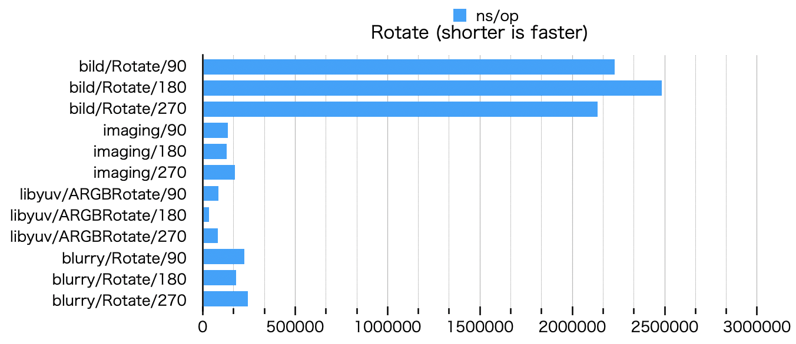

```
goos: darwin
goarch: amd64
pkg: github.com/octu0/blurry/benchmark
cpu: Intel(R) Core(TM) i7-8569U CPU @ 2.80GHz
BenchmarkRotate
BenchmarkRotate/bild/Rotate/90
BenchmarkRotate/bild/Rotate/90-8         	     582	   2230286 ns/op	 1237036 B/op	  115685 allocs/op
BenchmarkRotate/bild/Rotate/180
BenchmarkRotate/bild/Rotate/180-8        	     493	   2484821 ns/op	 1540310 B/op	  153605 allocs/op
BenchmarkRotate/bild/Rotate/270
BenchmarkRotate/bild/Rotate/270-8        	     526	   2135527 ns/op	 1236930 B/op	  115685 allocs/op
BenchmarkRotate/imaging/90
BenchmarkRotate/imaging/90-8             	    7626	    136134 ns/op	  314182 B/op	       6 allocs/op
BenchmarkRotate/imaging/180
BenchmarkRotate/imaging/180-8            	    9528	    127362 ns/op	  313541 B/op	       6 allocs/op
BenchmarkRotate/imaging/270
BenchmarkRotate/imaging/270-8            	    7866	    174405 ns/op	  314164 B/op	       6 allocs/op
BenchmarkRotate/libyuv/ARGBRotate/90
BenchmarkRotate/libyuv/ARGBRotate/90-8   	   13598	     83944 ns/op	  311360 B/op	       2 allocs/op
BenchmarkRotate/libyuv/ARGBRotate/180
BenchmarkRotate/libyuv/ARGBRotate/180-8  	   33970	     33696 ns/op	  311361 B/op	       2 allocs/op
BenchmarkRotate/libyuv/ARGBRotate/270
BenchmarkRotate/libyuv/ARGBRotate/270-8  	   14926	     80698 ns/op	  311361 B/op	       2 allocs/op
BenchmarkRotate/blurry/Rotate/90
BenchmarkRotate/blurry/Rotate/90-8       	    5629	    224277 ns/op	  311489 B/op	       3 allocs/op
BenchmarkRotate/blurry/Rotate/180
BenchmarkRotate/blurry/Rotate/180-8      	    7006	    178531 ns/op	  311489 B/op	       3 allocs/op
BenchmarkRotate/blurry/Rotate/270
BenchmarkRotate/blurry/Rotate/270-8      	    5060	    244755 ns/op	  311489 B/op	       3 allocs/op
```

### Sobel

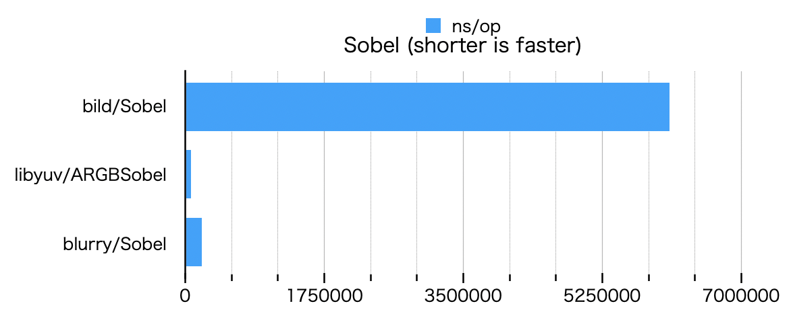

```
goos: darwin
goarch: amd64
pkg: github.com/octu0/blurry/benchmark
cpu: Intel(R) Core(TM) i7-8569U CPU @ 2.80GHz
BenchmarkSobel
BenchmarkSobel/bild/Sobel
BenchmarkSobel/bild/Sobel-8         	     201	   6093924 ns/op	 2196805 B/op	      32 allocs/op
BenchmarkSobel/libyuv/ARGBSobel
BenchmarkSobel/libyuv/ARGBSobel-8   	   15313	     73065 ns/op	  311361 B/op	       2 allocs/op
BenchmarkSobel/blurry/Sobel
BenchmarkSobel/blurry/Sobel-8       	    5816	    204196 ns/op	  311489 B/op	       3 allocs/op
```

### Other Benchmarks

See [benchmark](https://github.com/octu0/blurry/tree/master/benchmark) for benchmarks of other methods and performance comparison with [libyuv](https://chromium.googlesource.com/libyuv/libyuv/).


# Installation

```shell
$ go get github.com/octu0/blurry
```

## Examples

original image

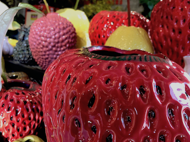

### Rotate

rotation 0/90/180/270 clockwise

```go
img, err := blurry.Rotate(input, blurry.Rotate90)
```

| `blurry.RotationMode` | Result                             |
| :-------------------: | :--------------------------------: |
| `blurry.Rotate90`     | 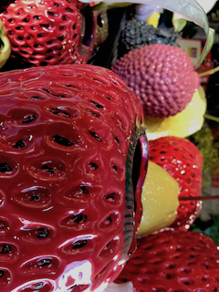  |
| `blurry.Rotate180`    | 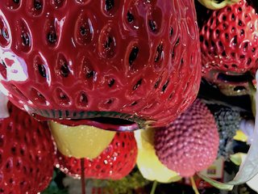 |
| `blurry.Rotate270`    |  |

### Grayscale

```go
img, err := blurry.Grayscale(input)
```

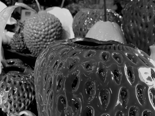

### Invert

```go
img, err := blurry.Invert(input)
```

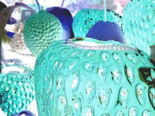

### Brightness

```go
img, err := blurry.Brightness(input, 1.5)
```

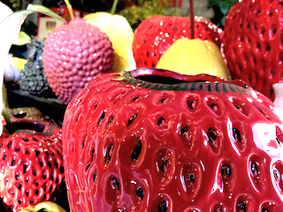

### Gamma

```go
img, err := blurry.Gamma(input, 2.5)
```

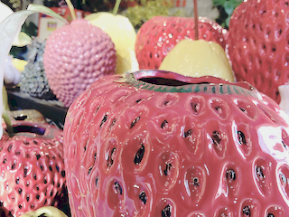

### Contrast

```go
img, err := blurry.Contrast(input, 0.525)
```

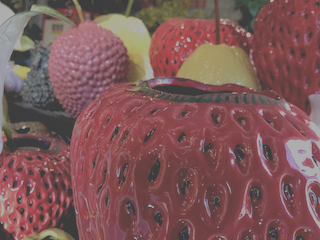

### BoxBlur

```go
img, err := blurry.Boxblur(input, 11)
```


### GaussianBlur

```go
img, err := blurry.Gaussianblur(input, 5.0)
```

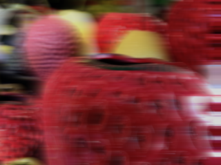

### BlockMozaic

```go
img, err := blurry.Blockmozaic(input, 10)
```


### Erode

```go
img, err := blurry.Erosion(input, 5)
```

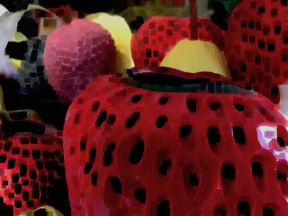

### Dilate

```go
img, err := blurry.Dilation(input, 8)
```

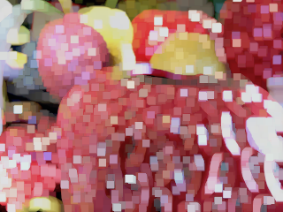

### Morphology

Morphology repeats Erode and Dilate N times.

```go
size := 5
N := 2
img, err := blurry.Morphology(input, MorphOpen, size, N)
```

| `blurry.MorphologyMode`     | Result                                       |
| :-------------------------: | :------------------------------------------: |
| `blurry.MorphologyOpen`     | 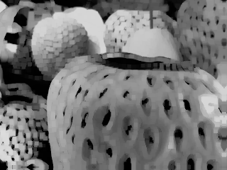     |
| `blurry.MorphologyClose`    | 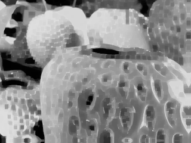    |
| `blurry.MorphologyGradient` | 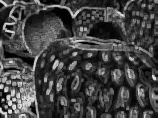 |

### Emboss

```go
img, err := blurry.Emboss(input)
```

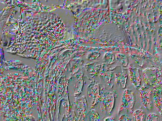

### HighPass

```go
img, err := blurry.Highpass(input)
```

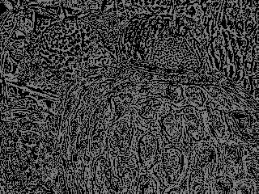

### Laplacian

```go
img, err := blurry.Laplacian(input)
```

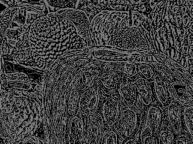

### Gradient

```go
img, err := blurry.Gradient(input)
```

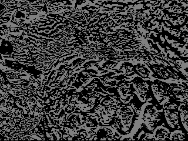

### Edge

a.k.a. Edge Detection

```go
img, err := blurry.Edge(input)
```

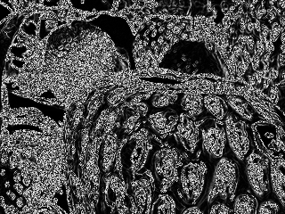

### Sobel

```go
img, err := blurry.Sobel(input)
```

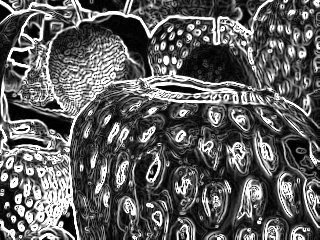

### Canny

a.k.a. Canny Edge Detection

```go
img, err := blurry.Canny(input, 250, 100)
```

| `max:250 min:100`                | `max:400 min:10`                             |
| :------------------------------: | :------------------------------------------: |
| 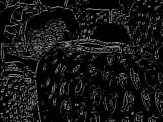   | 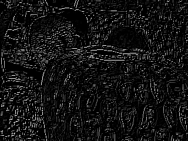 |

#### Canny with Dilate

```go
img, err := blurry.CannyWithDilate(input, 250, 100, 3)
```

| `max:250 min:100 dilate:3`                           | `max:250 min:150 dilate:4`                            |
| :--------------------------------------------------: | :---------------------------------------------------: |
| 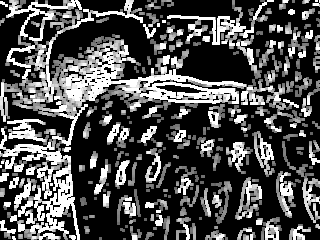 | 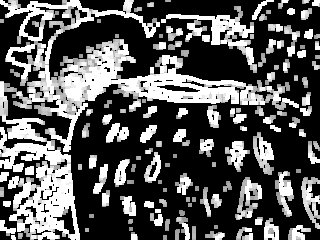 |

#### Morphology Canny with Dilate

Pre-process morphology before applying Canny process.

```go
mode := blurry.CannyMorphologyClose
morph_size := 5
dilate_size := 3
img, err := blurry.MorphologyCannyWithDilate(input, 250, 100, mode, morph_size, dilate_size);
```

| `blurry.CannyMorphologyMode` | Result                                       |
| :-------------------------:  | :------------------------------------------: |
| `blurry.CannyMorphologyOpen` | 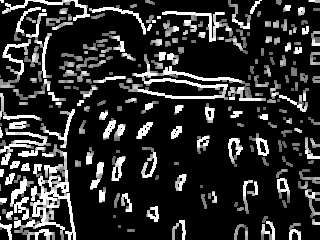 |
| `blurry.CannyMorphologyClose` | 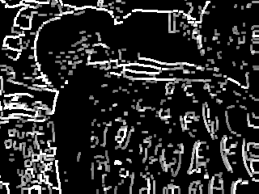 |

### Template Matching

SAD(Sum of Absolute Difference), SSD(Sum of Squared Difference), NCC(Normalized Cross Correlation) AND ZNCC(Zero means Normalized Cross Correlation) methods are available for template matching.

#### SAD

```go
scores, err := blurry.MatchTemplateSAD(input, template, 1000)
```

| filter                       | input                                            | template                                         | Result                                              |
| :--------------------------: | :----------------------------------------------: | :----------------------------------------------: | :-------------------------------------------------: |
| `none`                       |                      |                      | 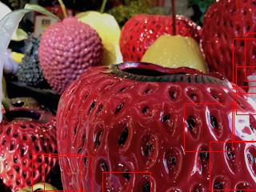                     |
| `grayscale`                  |                |                 |                 |
| `sobel`                      |                    | 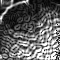               | 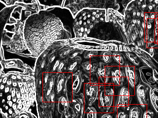               |
| `canny dilate:3  morph:open` | 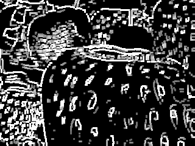 | 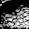 |  |

#### SSD

```go
scores, err := blurry.MatchTemplateSSD(input, template, 1000)
```

| filter                       | input                                            | template                                         | Result                                              |
| :--------------------------: | :----------------------------------------------: | :----------------------------------------------: | :-------------------------------------------------: |
| `none`                       |                      |                      | 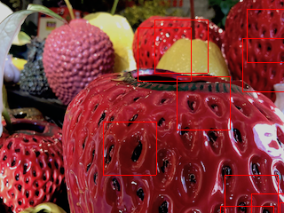                     |
| `grayscale`                  |                |                 | 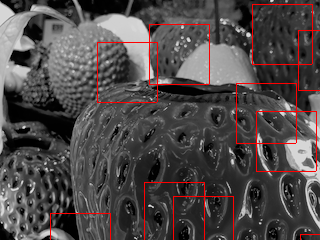                |
| `sobel`                      |                    |                | 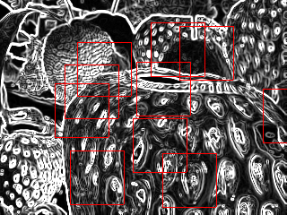               |
| `canny dilate:3  morph:open` |  |  | 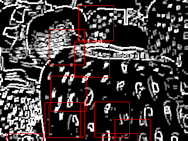 |

#### NCC

```go
scores, err := blurry.MatchTemplateNCC(input, template, 0.1)
```

| filter                       | input                                            | template                                         | Result                                              |
| :--------------------------: | :----------------------------------------------: | :----------------------------------------------: | :-------------------------------------------------: |
| `none`                       |                      |                      |                      |
| `grayscale`                  |                |                 |                 |
| `sobel`                      |                    |                |                |
| `canny dilate:3  morph:open` |  |  | 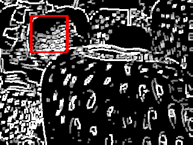 |

#### Prepared NCC

Improve processing speed by pre-calculating part of NCC process.

```go
p, err := blurry.PrepareNCCTemplate(template)
if err != nil {
  panic(err)
}
defer blurry.FreePreparedNCCTemplate(p)

for _, img := range images {
  scores, err := blurry.PreparedMatchTemplateNCC(img, p, 0.1)
  if err != nil {
    panic(err)
  }
}
```

#### ZNCC

```go
scores, err := blurry.MatchTemplateZNCC(input, template, 0.1)
```

| filter                       | input                                            | template                                         | Result                                              |
| :--------------------------: | :----------------------------------------------: | :----------------------------------------------: | :-------------------------------------------------: |
| `none`                       |                      |                      | 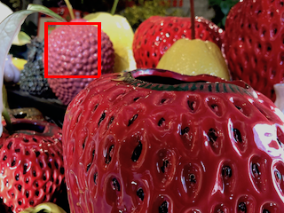                     |
| `grayscale`                  |                |                 | 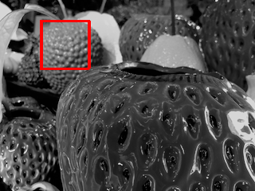                |
| `sobel`                      |                    |                | 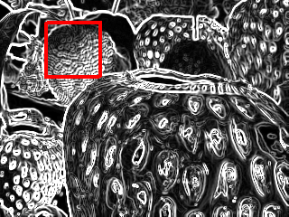               |
| `canny dilate:3  morph:open` |  |  |  |

#### Prepared ZNCC

Improve processing speed by pre-calculating part of ZNCC process.

```go
p, err := blurry.PrepareZNCCTemplate(template)
if err != nil {
  panic(err)
}
defer blurry.FreePreparedZNCCTemplate(p)

for _, img := range images {
  scores, err := blurry.PreparedMatchTemplateZNCC(img, p, 0.1)
  if err != nil {
    panic(err)
  }
}
```

### Blend

Blend input1 on input0.

```go
img, err := blurry.Blend(input0, input1, image.Pt(76, 36), blurry.BlendNormal)
```

| `blurry.BlendMode`    | Result                                |
| :-------------------: | :-----------------------------------: |
| `blurry.BlendNormal`  | 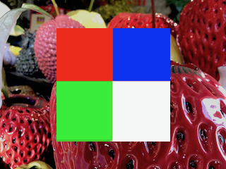 |
| `blurry.BlendSub`     | 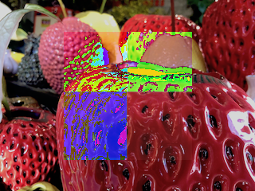    |
| `blurry.BlendAdd`     | 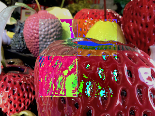    |
| `blurry.BlendDiff`    | 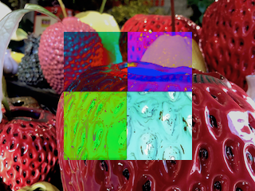   |

## CLI usage

Run it via docker.  
Use `docker run -v` to specify where to load the images and where to output them (`/tmp` will be used as a temporary file).

```shell
$ mkdir myimagedir
$ mkdir myimageout
$ cp /from/img/path.png myimagedir/src.png

# grayscale
$ docker run --rm -it \
  -v $PWD/myimagedir:/img \
  -v $PWD/myimageout:/tmp \
  blurry:1.0.0 grayscale -i /img/src.png
```

#### Help

```
NAME:
   blurry

USAGE:
   blurry [global options] command [command options] [arguments...]

VERSION:
   1.16.0

COMMANDS:
     blend
     blockmozaic
     boxblur
     brightness
     canny
     clone
     contrast
     dilation
     edge
     emboss
     erosion
     gamma
     gaussianblur
     gradient
     grayscale
     highpass
     invert
     laplacian
     morphology
     match_template
     rotate
     sobel
     help, h         Shows a list of commands or help for one command

GLOBAL OPTIONS:
   --debug, -d    debug mode
   --verbose, -V  verbose. more message
   --help, -h     show help
   --version, -v  print the version
```

# Build

When building, create a docker container with Halide(clang, llvm, etc).
installed as the build environment.

```shell
$ make build-generator
```

Compile `libruntime.a` and all kinds `lib*_osx.a` or `lib*_linu.a` to make static link.

```shell
$ make generate
```

Finally, generate a docker image if necessary.

```
$ make build
```

# Develop

Set up configuration for macos to be able to run image filtering directly through Halide.

## setup Halide on local

```shell
$ make setup-halide-runtime
```

## generate and run

`genrun` package allows you to export images to temporary file and run image filtering directly.

```shell
$ go run cmd/genrun/main.go benchmark
```

# License

MIT, see LICENSE file for details.
