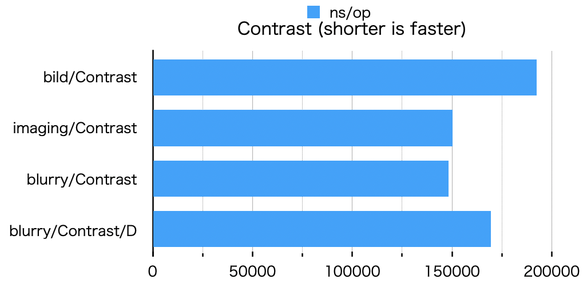
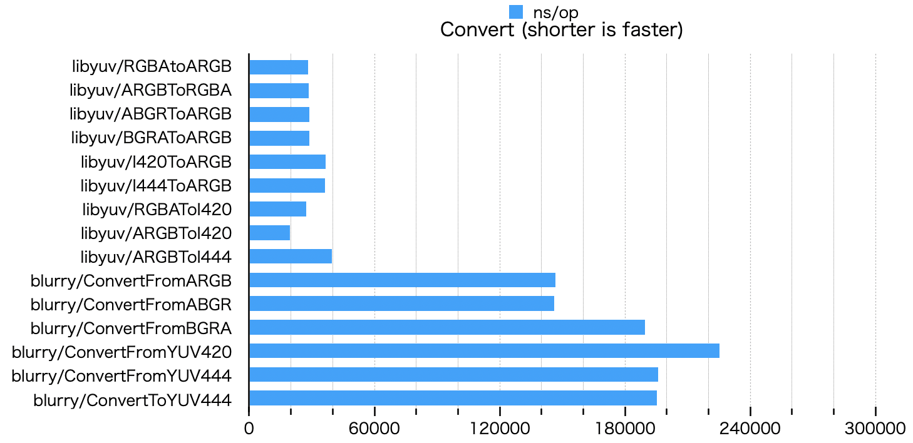
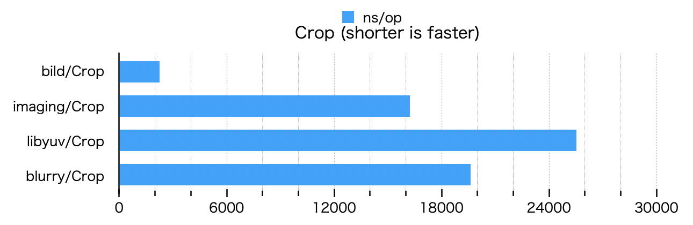
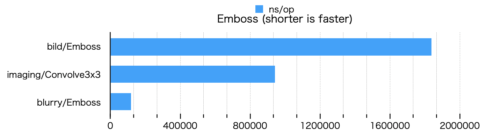
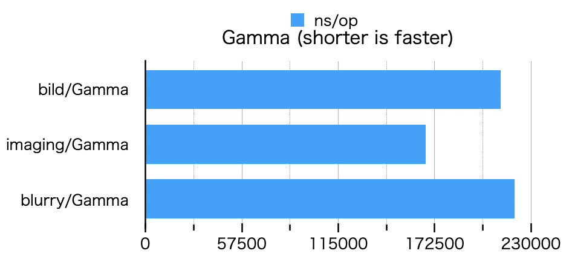
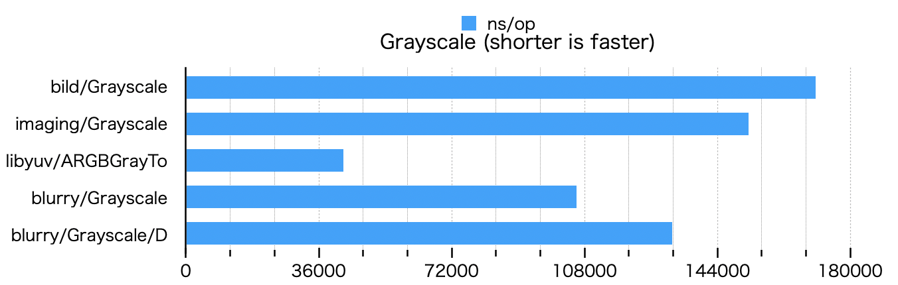
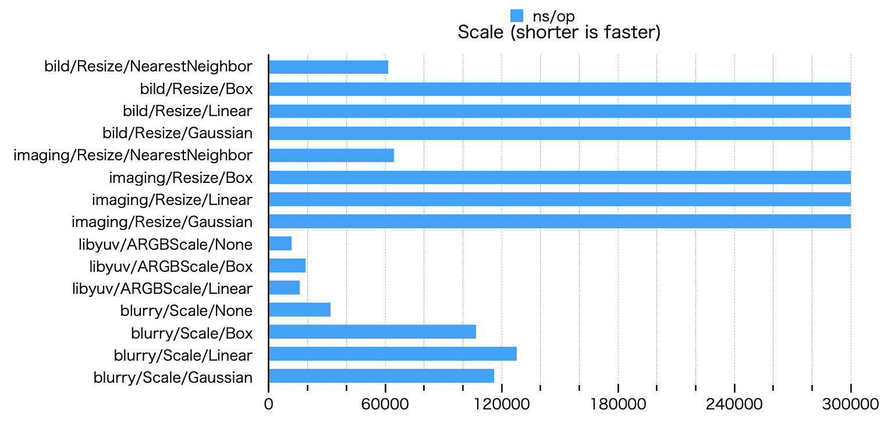

# Benchmark

In [cgo](https://golang.org/cmd/cgo/), due to the overhead of ffi calls([e.g.](https://about.sourcegraph.com/go/gophercon-2018-adventures-in-cgo-performance/)), 
more complex operations will be optimized for CPU and become faster.  


## Blur


/D is [DisablePool](https://pkg.go.dev/github.com/octu0/blurry#DisablePool), i.e. the benchmark when BufferPool is off.

```
goos: darwin
goarch: amd64
pkg: github.com/octu0/blurry/benchmark
cpu: Intel(R) Core(TM) i7-8569U CPU @ 2.80GHz
BenchmarkBlur
BenchmarkBlur/bild/blur/Box
BenchmarkBlur/bild/blur/Box-8         	     150	   7901781 ns/op	  640405 B/op	      11 allocs/op
BenchmarkBlur/bild/blur/Gaussian
BenchmarkBlur/bild/blur/Gaussian-8    	     331	   3751497 ns/op	 1262480 B/op	      21 allocs/op
BenchmarkBlur/imaging/Blur
BenchmarkBlur/imaging/Blur-8          	     782	   1520597 ns/op	  793694 B/op	      45 allocs/op
BenchmarkBlur/stackblur-go
BenchmarkBlur/stackblur-go-8          	     244	   4963000 ns/op	  925937 B/op	  153609 allocs/op
BenchmarkBlur/libyuv/ARGBBlur
BenchmarkBlur/libyuv/ARGBBlur-8       	    1861	    635287 ns/op	10182724 B/op	       3 allocs/op
BenchmarkBlur/blurry/Boxblur
BenchmarkBlur/blurry/Boxblur-8        	    9319	    134460 ns/op	      88 B/op	       2 allocs/op
BenchmarkBlur/blurry/Gaussianblur
BenchmarkBlur/blurry/Gaussianblur-8   	    2943	    350995 ns/op	     194 B/op	       2 allocs/op
BenchmarkBlur/blurry/Boxblur/D
BenchmarkBlur/blurry/Boxblur/D-8      	    7401	    179539 ns/op	  311361 B/op	       2 allocs/op
BenchmarkBlur/blurry/Gaussianblur/D
BenchmarkBlur/blurry/Gaussianblur/D-8 	    2733	    383585 ns/op	  311361 B/op	       2 allocs/op
```

## Blend


```
goos: darwin
goarch: amd64
pkg: github.com/octu0/blurry/benchmark
cpu: Intel(R) Core(TM) i7-8569U CPU @ 2.80GHz
BenchmarkBlend
BenchmarkBlend/bild/Blend/Normal
BenchmarkBlend/bild/Blend/Normal-8         	    1912	    703843 ns/op	  311459 B/op	       4 allocs/op
BenchmarkBlend/bild/Blend/Add
BenchmarkBlend/bild/Blend/Add-8            	    1557	    702843 ns/op	  311425 B/op	       4 allocs/op
BenchmarkBlend/bild/Blend/Subtract
BenchmarkBlend/bild/Blend/Subtract-8       	    1683	    704056 ns/op	  311425 B/op	       4 allocs/op
BenchmarkBlend/imaging/Paste
BenchmarkBlend/imaging/Paste-8             	    6037	    201850 ns/op	  315751 B/op	      10 allocs/op
BenchmarkBlend/libyuv/ARGBAdd
BenchmarkBlend/libyuv/ARGBAdd-8            	   30560	     36185 ns/op	  311360 B/op	       2 allocs/op
BenchmarkBlend/libyuv/ARGBSubtract
BenchmarkBlend/libyuv/ARGBSubtract-8       	   33194	     35365 ns/op	  311361 B/op	       2 allocs/op
BenchmarkBlend/blurry/Blend/Normal
BenchmarkBlend/blurry/Blend/Normal-8       	   10000	    103113 ns/op	     119 B/op	       2 allocs/op
BenchmarkBlend/blurry/Blend/Add
BenchmarkBlend/blurry/Blend/Add-8          	   10000	    110562 ns/op	     119 B/op	       2 allocs/op
BenchmarkBlend/blurry/Blend/Sub
BenchmarkBlend/blurry/Blend/Sub-8          	    9728	    122189 ns/op	     120 B/op	       2 allocs/op
```

## Contrast



/D is [DisablePool](https://pkg.go.dev/github.com/octu0/blurry#DisablePool), i.e. the benchmark when BufferPool is off.

```
goos: darwin
goarch: amd64
pkg: github.com/octu0/blurry/benchmark
cpu: Intel(R) Core(TM) i7-8569U CPU @ 2.80GHz
BenchmarkContrast
BenchmarkContrast/bild/Contrast
BenchmarkContrast/bild/Contrast-8         	    5983	    192479 ns/op	  311706 B/op	       6 allocs/op
BenchmarkContrast/imaging/Contrast
BenchmarkContrast/imaging/Contrast-8      	    8102	    150315 ns/op	  313796 B/op	       7 allocs/op
BenchmarkContrast/blurry/Contrast
BenchmarkContrast/blurry/Contrast-8       	    8150	    148220 ns/op	     126 B/op	       2 allocs/op
BenchmarkContrast/blurry/Contrast/D
BenchmarkContrast/blurry/Contrast/D-8     	    6895	    169469 ns/op	  311360 B/op	       2 allocs/op
```

## Convert



```
goos: darwin
goarch: amd64
pkg: github.com/octu0/blurry/benchmark
cpu: Intel(R) Core(TM) i7-8569U CPU @ 2.80GHz
BenchmarkConvert
BenchmarkConvert/libyuv/RGBAtoARGB
BenchmarkConvert/libyuv/RGBAtoARGB-8         	   41944	     28145 ns/op	  311361 B/op	       2 allocs/op
BenchmarkConvert/libyuv/ARGBToRGBA
BenchmarkConvert/libyuv/ARGBToRGBA-8         	   41197	     28643 ns/op	  311361 B/op	       2 allocs/op
BenchmarkConvert/libyuv/ABGRToARGB
BenchmarkConvert/libyuv/ABGRToARGB-8         	   41390	     28748 ns/op	  311361 B/op	       2 allocs/op
BenchmarkConvert/libyuv/BGRAToARGB
BenchmarkConvert/libyuv/BGRAToARGB-8         	   41130	     28707 ns/op	  311361 B/op	       2 allocs/op
BenchmarkConvert/libyuv/I420ToARGB
BenchmarkConvert/libyuv/I420ToARGB-8         	   32671	     36616 ns/op	  311361 B/op	       2 allocs/op
BenchmarkConvert/libyuv/I444ToARGB
BenchmarkConvert/libyuv/I444ToARGB-8         	   32624	     36163 ns/op	  311361 B/op	       2 allocs/op
BenchmarkConvert/libyuv/RGBAToI420
BenchmarkConvert/libyuv/RGBAToI420-8         	   42903	     27372 ns/op	  123008 B/op	       4 allocs/op
BenchmarkConvert/libyuv/ARGBToI420
BenchmarkConvert/libyuv/ARGBToI420-8         	   60031	     19509 ns/op	  123008 B/op	       4 allocs/op
BenchmarkConvert/libyuv/ARGBToI444
BenchmarkConvert/libyuv/ARGBToI444-8         	   29774	     39668 ns/op	  245888 B/op	       4 allocs/op
BenchmarkConvert/blurry/ConvertFromARGB
BenchmarkConvert/blurry/ConvertFromARGB-8    	    8446	    146548 ns/op	  311500 B/op	       3 allocs/op
BenchmarkConvert/blurry/ConvertFromABGR
BenchmarkConvert/blurry/ConvertFromABGR-8    	    8344	    146218 ns/op	  311500 B/op	       3 allocs/op
BenchmarkConvert/blurry/ConvertFromBGRA
BenchmarkConvert/blurry/ConvertFromBGRA-8    	    6608	    189616 ns/op	  311515 B/op	       3 allocs/op
BenchmarkConvert/blurry/ConvertFromYUV420
BenchmarkConvert/blurry/ConvertFromYUV420-8  	    5008	    225420 ns/op	  311532 B/op	       3 allocs/op
BenchmarkConvert/blurry/ConvertFromYUV444
BenchmarkConvert/blurry/ConvertFromYUV444-8  	    6094	    195877 ns/op	  311520 B/op	       3 allocs/op
BenchmarkConvert/blurry/ConvertToYUV444
BenchmarkConvert/blurry/ConvertToYUV444-8    	    6105	    195209 ns/op	  237815 B/op	       3 allocs/op
```

## Crop



```
goos: darwin
goarch: amd64
pkg: github.com/octu0/blurry/benchmark
cpu: Intel(R) Core(TM) i7-8569U CPU @ 2.80GHz
BenchmarkCrop
BenchmarkCrop/bild/Crop
BenchmarkCrop/bild/Crop-8         	  536024	      2242 ns/op	   16512 B/op	       3 allocs/op
BenchmarkCrop/imaging/Crop
BenchmarkCrop/imaging/Crop-8      	   72818	     16218 ns/op	   17104 B/op	       6 allocs/op
BenchmarkCrop/libyuv/Crop
BenchmarkCrop/libyuv/Crop-8       	   49740	     25516 ns/op	  311360 B/op	       2 allocs/op
BenchmarkCrop/blurry/Crop
BenchmarkCrop/blurry/Crop-8       	   65932	     19613 ns/op	   16478 B/op	       3 allocs/op
```

## Edge


```
goos: darwin
goarch: amd64
pkg: github.com/octu0/blurry/benchmark
cpu: Intel(R) Core(TM) i7-8569U CPU @ 2.80GHz
BenchmarkEdge
BenchmarkEdge/bild/EdgeDetection
BenchmarkEdge/bild/EdgeDetection-8         	     618	   2018322 ns/op	  631294 B/op	      10 allocs/op
BenchmarkEdge/blurry/Edge
BenchmarkEdge/blurry/Edge-8                	    7792	    140375 ns/op	  311488 B/op	       3 allocs/op
```

## Emboss



```
goos: darwin
goarch: amd64
pkg: github.com/octu0/blurry/benchmark
cpu: Intel(R) Core(TM) i7-8569U CPU @ 2.80GHz
BenchmarkEmboss
BenchmarkEmboss/bild/Emboss
BenchmarkEmboss/bild/Emboss-8         	     612	   1942848 ns/op	  631282 B/op	      10 allocs/op
BenchmarkEmboss/imaging/Convolve3x3
BenchmarkEmboss/imaging/Convolve3x3-8 	    1234	    978724 ns/op	  627413 B/op	      16 allocs/op
BenchmarkEmboss/blurry/Emboss
BenchmarkEmboss/blurry/Emboss-8       	    4455	    252560 ns/op	      88 B/op	       2 allocs/op
```

## Gamma



```
goos: darwin
goarch: amd64
pkg: github.com/octu0/blurry/benchmark
cpu: Intel(R) Core(TM) i7-8569U CPU @ 2.80GHz
BenchmarkGamma
BenchmarkGamma/bild/Gamma
BenchmarkGamma/bild/Gamma-8         	    5610	    211753 ns/op	  311710 B/op	       6 allocs/op
BenchmarkGamma/imaging/Gamma
BenchmarkGamma/imaging/Gamma-8      	    7389	    167046 ns/op	  313794 B/op	       7 allocs/op
BenchmarkGamma/blurry/Gamma
BenchmarkGamma/blurry/Gamma-8       	    5488	    220096 ns/op	  311487 B/op	       3 allocs/op
```

## Grayscale



```
goos: darwin
goarch: amd64
pkg: github.com/octu0/blurry/benchmark
cpu: Intel(R) Core(TM) i7-8569U CPU @ 2.80GHz
BenchmarkGrayscale
BenchmarkGrayscale/bild/Grayscale
BenchmarkGrayscale/bild/Grayscale-8         	    5702	    176355 ns/op	  622815 B/op	       6 allocs/op
BenchmarkGrayscale/imaging/Grayscale
BenchmarkGrayscale/imaging/Grayscale-8      	    8100	    153272 ns/op	  313516 B/op	       6 allocs/op
BenchmarkGrayscale/libyuv/ARGBGrayTo
BenchmarkGrayscale/libyuv/ARGBGrayTo-8      	   27177	     43139 ns/op	  311360 B/op	       2 allocs/op
BenchmarkGrayscale/blurry/Grayscale
BenchmarkGrayscale/blurry/Grayscale-8       	    9724	    125826 ns/op	     120 B/op	       2 allocs/op
BenchmarkGrayscale/blurry/Grayscale/D
BenchmarkGrayscale/blurry/Grayscale/D-8     	    7965	    148998 ns/op	  311360 B/op	       2 allocs/op
```

## Rotate


```
goos: darwin
goarch: amd64
pkg: github.com/octu0/blurry/benchmark
cpu: Intel(R) Core(TM) i7-8569U CPU @ 2.80GHz
BenchmarkRotate
BenchmarkRotate/bild/Rotate/90
BenchmarkRotate/bild/Rotate/90-8         	     634	   1941369 ns/op	 1237045 B/op	  115685 allocs/op
BenchmarkRotate/bild/Rotate/180
BenchmarkRotate/bild/Rotate/180-8        	     529	   2426364 ns/op	 1540316 B/op	  153605 allocs/op
BenchmarkRotate/bild/Rotate/270
BenchmarkRotate/bild/Rotate/270-8        	     531	   1927780 ns/op	 1236940 B/op	  115685 allocs/op
BenchmarkRotate/imaging/90
BenchmarkRotate/imaging/90-8             	    7983	    133069 ns/op	  314181 B/op	       6 allocs/op
BenchmarkRotate/imaging/180
BenchmarkRotate/imaging/180-8            	    9532	    124640 ns/op	  313543 B/op	       6 allocs/op
BenchmarkRotate/imaging/270
BenchmarkRotate/imaging/270-8            	    8282	    150670 ns/op	  314163 B/op	       6 allocs/op
BenchmarkRotate/libyuv/ARGBRotate/90
BenchmarkRotate/libyuv/ARGBRotate/90-8   	   14402	     77141 ns/op	  311360 B/op	       2 allocs/op
BenchmarkRotate/libyuv/ARGBRotate/180
BenchmarkRotate/libyuv/ARGBRotate/180-8  	   34760	     33234 ns/op	  311361 B/op	       2 allocs/op
BenchmarkRotate/libyuv/ARGBRotate/270
BenchmarkRotate/libyuv/ARGBRotate/270-8  	   15648	     76499 ns/op	  311361 B/op	       2 allocs/op
BenchmarkRotate/blurry/Rotate/90
BenchmarkRotate/blurry/Rotate/90-8       	    8181	    152166 ns/op	  311515 B/op	       3 allocs/op
BenchmarkRotate/blurry/Rotate/180
BenchmarkRotate/blurry/Rotate/180-8      	    7290	    166957 ns/op	  311515 B/op	       3 allocs/op
BenchmarkRotate/blurry/Rotate/270
BenchmarkRotate/blurry/Rotate/270-8      	    5473	    227141 ns/op	  311515 B/op	       3 allocs/op
```

## Scale



```
goos: darwin
goarch: amd64
pkg: github.com/octu0/blurry/benchmark
cpu: Intel(R) Core(TM) i7-8569U CPU @ 2.80GHz
BenchmarkScale
BenchmarkScale/bild/Resize/NearestNeighbor
BenchmarkScale/bild/Resize/NearestNeighbor-8         	   19465	     61235 ns/op	   49216 B/op	       2 allocs/op
BenchmarkScale/bild/Resize/Box
BenchmarkScale/bild/Resize/Box-8                     	    2551	    474613 ns/op	  172386 B/op	       8 allocs/op
BenchmarkScale/bild/Resize/Linear
BenchmarkScale/bild/Resize/Linear-8                  	    1587	    745951 ns/op	  172384 B/op	       8 allocs/op
BenchmarkScale/bild/Resize/Gaussian
BenchmarkScale/bild/Resize/Gaussian-8                	     169	   7425608 ns/op	  172386 B/op	       8 allocs/op
BenchmarkScale/imaging/Resize/NearestNeighbor
BenchmarkScale/imaging/Resize/NearestNeighbor-8      	   24284	     56471 ns/op	   50241 B/op	       6 allocs/op
BenchmarkScale/imaging/Resize/Box
BenchmarkScale/imaging/Resize/Box-8                  	    3610	    338350 ns/op	  228097 B/op	      32 allocs/op
BenchmarkScale/imaging/Resize/Linear
BenchmarkScale/imaging/Resize/Linear-8               	    2815	    420133 ns/op	  236288 B/op	      32 allocs/op
BenchmarkScale/imaging/Resize/Gaussian
BenchmarkScale/imaging/Resize/Gaussian-8             	    1813	    647367 ns/op	  249858 B/op	      32 allocs/op
BenchmarkScale/libyuv/Scale/None
BenchmarkScale/libyuv/Scale/None-8                   	   93351	     11788 ns/op	   49216 B/op	       2 allocs/op
BenchmarkScale/libyuv/Scale/Box
BenchmarkScale/libyuv/Scale/Box-8                    	   65517	     17873 ns/op	   49216 B/op	       2 allocs/op
BenchmarkScale/libyuv/Scale/Linear
BenchmarkScale/libyuv/Scale/Linear-8                 	   79173	     14884 ns/op	   49216 B/op	       2 allocs/op
BenchmarkScale/blurry/Scale/None
BenchmarkScale/blurry/Scale/None-8                   	   40149	     29531 ns/op	   49259 B/op	       3 allocs/op
BenchmarkScale/blurry/Scale/Box
BenchmarkScale/blurry/Scale/Box-8                    	    6210	    187003 ns/op	   49260 B/op	       3 allocs/op
BenchmarkScale/blurry/Scale/Linear
BenchmarkScale/blurry/Scale/Linear-8                 	    6373	    187795 ns/op	   49260 B/op	       3 allocs/op
BenchmarkScale/blurry/Scale/Gaussian
BenchmarkScale/blurry/Scale/Gaussian-8               	    6038	    191143 ns/op	   49260 B/op	       3 allocs/op
```

## Sobel


```
goos: darwin
goarch: amd64
pkg: github.com/octu0/blurry/benchmark
cpu: Intel(R) Core(TM) i7-8569U CPU @ 2.80GHz
BenchmarkSobel
BenchmarkSobel/bild/Sobel
BenchmarkSobel/bild/Sobel-8         	     201	   6093924 ns/op	 2196805 B/op	      32 allocs/op
BenchmarkSobel/libyuv/ARGBSobel
BenchmarkSobel/libyuv/ARGBSobel-8   	   15313	     73065 ns/op	  311361 B/op	       2 allocs/op
BenchmarkSobel/blurry/Sobel
BenchmarkSobel/blurry/Sobel-8       	    5816	    204196 ns/op	  311489 B/op	       3 allocs/op
```
