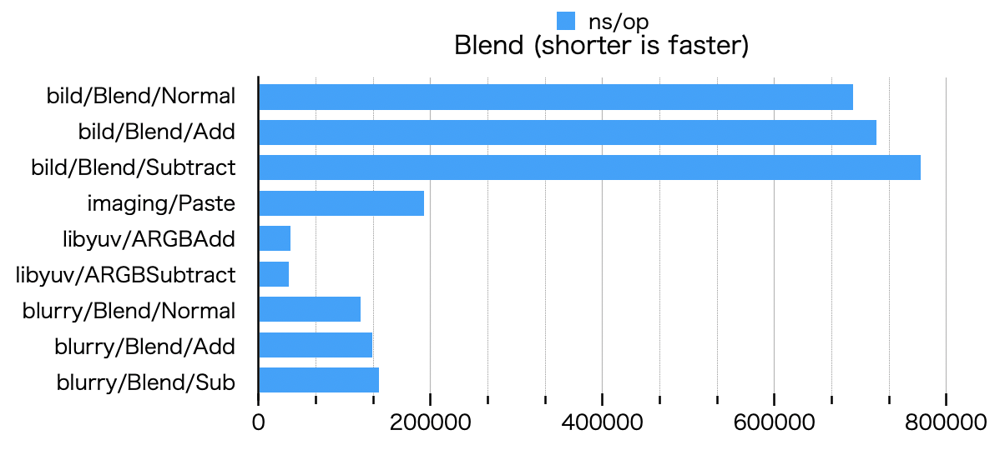
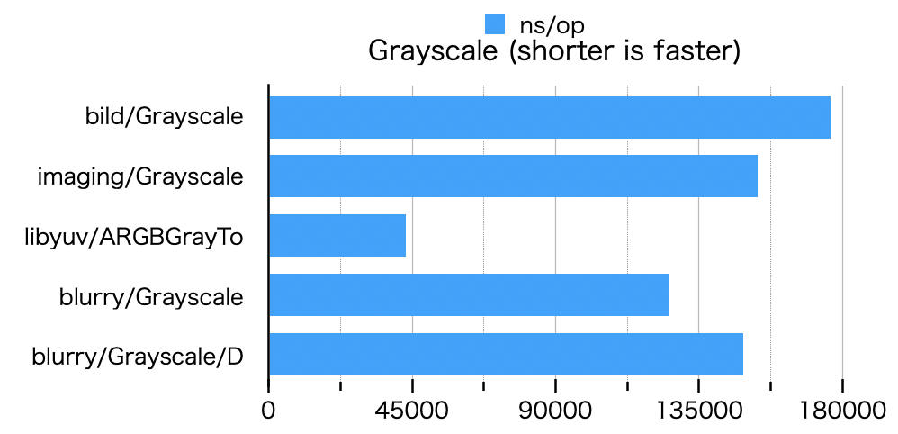

# Benchmark

In [cgo](https://golang.org/cmd/cgo/), due to the overhead of ffi calls([e.g.](https://about.sourcegraph.com/go/gophercon-2018-adventures-in-cgo-performance/)), 
more complex operations will be optimized for CPU and become faster.  


## Blur


/D is [DisablePool](https://pkg.go.dev/github.com/octu0/blurry#DisablePool), i.e. the benchmark when BufferPool is off.

```
goos: darwin
goarch: amd64
pkg: github.com/octu0/blurry/benchmark
cpu: Intel(R) Core(TM) i7-8569U CPU @ 2.80GHz
BenchmarkBlur
BenchmarkBlur/bild/blur/Box
BenchmarkBlur/bild/blur/Box-8         	     145	   8279131 ns/op	  640336 B/op	      11 allocs/op
BenchmarkBlur/bild/blur/Gaussian
BenchmarkBlur/bild/blur/Gaussian-8    	     325	   3742126 ns/op	 1262508 B/op	      21 allocs/op
BenchmarkBlur/imaging/Blur
BenchmarkBlur/imaging/Blur-8          	     762	   1551078 ns/op	  793695 B/op	      45 allocs/op
BenchmarkBlur/stackblur-go
BenchmarkBlur/stackblur-go-8          	     236	   5098631 ns/op	  925933 B/op	  153609 allocs/op
BenchmarkBlur/libyuv/ARGBBlur
BenchmarkBlur/libyuv/ARGBBlur-8       	    1783	    668378 ns/op	10182723 B/op	       3 allocs/op
BenchmarkBlur/blurry/Boxblur
BenchmarkBlur/blurry/Boxblur-8        	    5790	    220296 ns/op	     141 B/op	       2 allocs/op
BenchmarkBlur/blurry/Gaussianblur
BenchmarkBlur/blurry/Gaussianblur-8   	    4273	    263072 ns/op	     161 B/op	       2 allocs/op
BenchmarkBlur/blurry/Boxblur/D
BenchmarkBlur/blurry/Boxblur/D-8      	    5108	    235602 ns/op	  311361 B/op	       2 allocs/op
BenchmarkBlur/blurry/Gaussianblur/D
BenchmarkBlur/blurry/Gaussianblur/D-8 	    4250	    284221 ns/op	  311361 B/op	       2 allocs/op
```

## Blend



```
goos: darwin
goarch: amd64
pkg: github.com/octu0/blurry/benchmark
cpu: Intel(R) Core(TM) i7-8569U CPU @ 2.80GHz
BenchmarkBlend
BenchmarkBlend/bild/Blend/Normal
BenchmarkBlend/bild/Blend/Normal-8         	    1689	    691521 ns/op	  311466 B/op	       4 allocs/op
BenchmarkBlend/bild/Blend/Add
BenchmarkBlend/bild/Blend/Add-8            	    1664	    718701 ns/op	  311428 B/op	       4 allocs/op
BenchmarkBlend/bild/Blend/Subtract
BenchmarkBlend/bild/Blend/Subtract-8       	    1561	    769815 ns/op	  311426 B/op	       4 allocs/op
BenchmarkBlend/imaging/Paste
BenchmarkBlend/imaging/Paste-8             	    6140	    192764 ns/op	  315750 B/op	      10 allocs/op
BenchmarkBlend/libyuv/ARGBAdd
BenchmarkBlend/libyuv/ARGBAdd-8            	   28186	     36565 ns/op	  311360 B/op	       2 allocs/op
BenchmarkBlend/libyuv/ARGBSubtract
BenchmarkBlend/libyuv/ARGBSubtract-8       	   31562	     35271 ns/op	  311361 B/op	       2 allocs/op
BenchmarkBlend/blurry/Blend/Normal
BenchmarkBlend/blurry/Blend/Normal-8       	   10000	    118492 ns/op	     119 B/op	       2 allocs/op
BenchmarkBlend/blurry/Blend/Add
BenchmarkBlend/blurry/Blend/Add-8          	   10000	    132242 ns/op	     119 B/op	       2 allocs/op
BenchmarkBlend/blurry/Blend/Sub
BenchmarkBlend/blurry/Blend/Sub-8          	    8953	    139870 ns/op	     122 B/op	       2 allocs/op
```

## Contrast


/D is [DisablePool](https://pkg.go.dev/github.com/octu0/blurry#DisablePool), i.e. the benchmark when BufferPool is off.

```
goos: darwin
goarch: amd64
pkg: github.com/octu0/blurry/benchmark
cpu: Intel(R) Core(TM) i7-8569U CPU @ 2.80GHz
BenchmarkContrast
BenchmarkContrast/bild/Contrast
BenchmarkContrast/bild/Contrast-8         	    5983	    192479 ns/op	  311706 B/op	       6 allocs/op
BenchmarkContrast/imaging/Contrast
BenchmarkContrast/imaging/Contrast-8      	    8102	    150315 ns/op	  313796 B/op	       7 allocs/op
BenchmarkContrast/blurry/Contrast
BenchmarkContrast/blurry/Contrast-8       	    8150	    148220 ns/op	     126 B/op	       2 allocs/op
BenchmarkContrast/blurry/Contrast/D
BenchmarkContrast/blurry/Contrast/D-8     	    6895	    169469 ns/op	  311360 B/op	       2 allocs/op
```

## Edge


```
goos: darwin
goarch: amd64
pkg: github.com/octu0/blurry/benchmark
cpu: Intel(R) Core(TM) i7-8569U CPU @ 2.80GHz
BenchmarkEdge
BenchmarkEdge/bild/EdgeDetection
BenchmarkEdge/bild/EdgeDetection-8         	     618	   2018322 ns/op	  631294 B/op	      10 allocs/op
BenchmarkEdge/blurry/Edge
BenchmarkEdge/blurry/Edge-8                	    7792	    140375 ns/op	  311488 B/op	       3 allocs/op
```

## Emboss


```
goos: darwin
goarch: amd64
pkg: github.com/octu0/blurry/benchmark
cpu: Intel(R) Core(TM) i7-8569U CPU @ 2.80GHz
BenchmarkEmboss
BenchmarkEmboss/bild/Emboss
BenchmarkEmboss/bild/Emboss-8         	     612	   1942848 ns/op	  631282 B/op	      10 allocs/op
BenchmarkEmboss/imaging/Convolve3x3
BenchmarkEmboss/imaging/Convolve3x3-8 	    1234	    978724 ns/op	  627413 B/op	      16 allocs/op
BenchmarkEmboss/blurry/Emboss
BenchmarkEmboss/blurry/Emboss-8       	    4455	    252560 ns/op	      88 B/op	       2 allocs/op
```

## Gamma


```
goos: darwin
goarch: amd64
pkg: github.com/octu0/blurry/benchmark
cpu: Intel(R) Core(TM) i7-8569U CPU @ 2.80GHz
BenchmarkGamma
BenchmarkGamma/bild/Gamma
BenchmarkGamma/bild/Gamma-8         	    5610	    211753 ns/op	  311710 B/op	       6 allocs/op
BenchmarkGamma/imaging/Gamma
BenchmarkGamma/imaging/Gamma-8      	    7389	    167046 ns/op	  313794 B/op	       7 allocs/op
BenchmarkGamma/blurry/Gamma
BenchmarkGamma/blurry/Gamma-8       	    5488	    220096 ns/op	  311487 B/op	       3 allocs/op
```

## Grayscale



```
goos: darwin
goarch: amd64
pkg: github.com/octu0/blurry/benchmark
cpu: Intel(R) Core(TM) i7-8569U CPU @ 2.80GHz
BenchmarkGrayscale
BenchmarkGrayscale/bild/Grayscale
BenchmarkGrayscale/bild/Grayscale-8         	    5702	    176355 ns/op	  622815 B/op	       6 allocs/op
BenchmarkGrayscale/imaging/Grayscale
BenchmarkGrayscale/imaging/Grayscale-8      	    8100	    153272 ns/op	  313516 B/op	       6 allocs/op
BenchmarkGrayscale/libyuv/ARGBGrayTo
BenchmarkGrayscale/libyuv/ARGBGrayTo-8      	   27177	     43139 ns/op	  311360 B/op	       2 allocs/op
BenchmarkGrayscale/blurry/Grayscale
BenchmarkGrayscale/blurry/Grayscale-8       	    9724	    125826 ns/op	     120 B/op	       2 allocs/op
BenchmarkGrayscale/blurry/Grayscale/D
BenchmarkGrayscale/blurry/Grayscale/D-8     	    7965	    148998 ns/op	  311360 B/op	       2 allocs/op
```

## Rotate


```
goos: darwin
goarch: amd64
pkg: github.com/octu0/blurry/benchmark
cpu: Intel(R) Core(TM) i7-8569U CPU @ 2.80GHz
BenchmarkRotate
BenchmarkRotate/bild/Rotate/90
BenchmarkRotate/bild/Rotate/90-8         	     582	   2230286 ns/op	 1237036 B/op	  115685 allocs/op
BenchmarkRotate/bild/Rotate/180
BenchmarkRotate/bild/Rotate/180-8        	     493	   2484821 ns/op	 1540310 B/op	  153605 allocs/op
BenchmarkRotate/bild/Rotate/270
BenchmarkRotate/bild/Rotate/270-8        	     526	   2135527 ns/op	 1236930 B/op	  115685 allocs/op
BenchmarkRotate/imaging/90
BenchmarkRotate/imaging/90-8             	    7626	    136134 ns/op	  314182 B/op	       6 allocs/op
BenchmarkRotate/imaging/180
BenchmarkRotate/imaging/180-8            	    9528	    127362 ns/op	  313541 B/op	       6 allocs/op
BenchmarkRotate/imaging/270
BenchmarkRotate/imaging/270-8            	    7866	    174405 ns/op	  314164 B/op	       6 allocs/op
BenchmarkRotate/libyuv/ARGBRotate/90
BenchmarkRotate/libyuv/ARGBRotate/90-8   	   13598	     83944 ns/op	  311360 B/op	       2 allocs/op
BenchmarkRotate/libyuv/ARGBRotate/180
BenchmarkRotate/libyuv/ARGBRotate/180-8  	   33970	     33696 ns/op	  311361 B/op	       2 allocs/op
BenchmarkRotate/libyuv/ARGBRotate/270
BenchmarkRotate/libyuv/ARGBRotate/270-8  	   14926	     80698 ns/op	  311361 B/op	       2 allocs/op
BenchmarkRotate/blurry/Rotate/90
BenchmarkRotate/blurry/Rotate/90-8       	    5629	    224277 ns/op	  311489 B/op	       3 allocs/op
BenchmarkRotate/blurry/Rotate/180
BenchmarkRotate/blurry/Rotate/180-8      	    7006	    178531 ns/op	  311489 B/op	       3 allocs/op
BenchmarkRotate/blurry/Rotate/270
BenchmarkRotate/blurry/Rotate/270-8      	    5060	    244755 ns/op	  311489 B/op	       3 allocs/op
```

## Sobel


```
goos: darwin
goarch: amd64
pkg: github.com/octu0/blurry/benchmark
cpu: Intel(R) Core(TM) i7-8569U CPU @ 2.80GHz
BenchmarkSobel
BenchmarkSobel/bild/Sobel
BenchmarkSobel/bild/Sobel-8         	     201	   6093924 ns/op	 2196805 B/op	      32 allocs/op
BenchmarkSobel/libyuv/ARGBSobel
BenchmarkSobel/libyuv/ARGBSobel-8   	   15313	     73065 ns/op	  311361 B/op	       2 allocs/op
BenchmarkSobel/blurry/Sobel
BenchmarkSobel/blurry/Sobel-8       	    5816	    204196 ns/op	  311489 B/op	       3 allocs/op
```


